# HMS Core Lifestyle Demo App

English | [中文](README_ZH.md) | [Overview](#Overview) | [Download](#Download) | [Functions](#Functions) | [Development](#Development) | [Used Kits](#Used-Kits) | [Precautions](#Precautions) | [Technical Support](#Technical-Support)

## Overview

HMS Core provides basic capabilities and innovative solutions for lifestyle apps, helping improve app experience, boost purchase conversion, and enhance user loyalty, for sustainable monetization.

The HMS Core lifestyle demo app showcases common food delivery app functions, such as browsing, ordering, delivery, collecting and redeeming coupons, and modifying addresses. This demo app will help you understand how to integrate HMS Core capabilities, such as Location Kit, Map Kit, and Account Kit, into lifestyle apps, and which scenarios are most suited for the kits.

## Download

Scan the QR code for a specific region to try out the demo app.

<table><tr>
<td>

<p align="center">China</p>
</td>
<td>

<p align="center">Asia, Africa, and Latin America</p>
</td>
<td>

<p align="center">Europe</p>
</td>
<td>

<p align="center">Russia</p>
</td>
</tr></table>

## Functions

The HMS Core lifestyle demo app covers major delivery app functions, such as:

- Panoramic/Video display of a restaurant
- Text/Speech based restaurant search
- Video/Picture comments
- Membership card/Coupon manager
- Scanning a barcode to obtain coupon/store information
- Face/Fingerprint/Bank card payment
- Message push
- Delivery route planner
- Offline store navigation
- Address manager
- Order manager
- One-tap text translation
- Ad delivery
- One-tap sign-in and sign-out
- Version update notification

## Development

**Environment Requirements**

- Android Studio: 4.2
- Android SDK: 26
- Gradle: 6.3

**Procedure**

1. Clone the code repository.

   ```
    git clone https://github.com/HMS-Core/hms-lifestyle-demo.git
   ```

You can also download the ZIP package that contains the project.

2. Copy the JKS file and the **agconnect-services.json** file to the **app** directory. For details about how to generate the JKS file and **agconnect-services.json** file, please refer to [Configuring App Information in AppGallery Connect](https://developer.huawei.com/consumer/en/doc/development/HMSCore-Guides/config-agc-0000001050196065?ha_source=hms7).

3. Update the JKS file information and app ID in the app-level **build.gradle** file.

4. Run the following command to build the demo app:

   ```
    cd hms-lifestyle-demo
    gradle clean
    gradle build
   ```

## Used Kits

- Account Kit allows your users to quickly sign in to your app with their HUAWEI IDs. These IDs will be used for as long as the users use your app.

  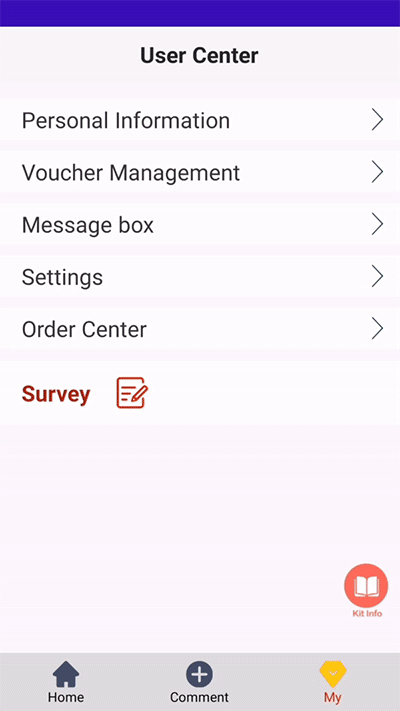

- Ads Kit enables ads display. When your app is launched, this kit is called and the app will display a splash ad. When a user browses a list of restaurants on your app, the native ad is displayed in the feed.

  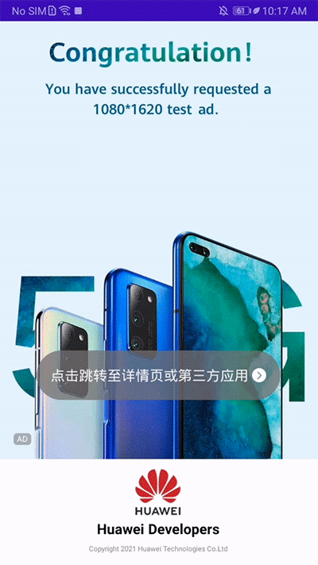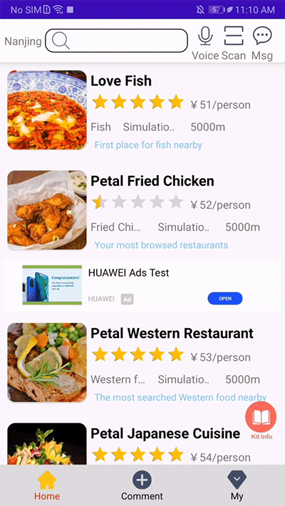

- When a user submits an order, Push Kit is called to push a message containing the order status.

  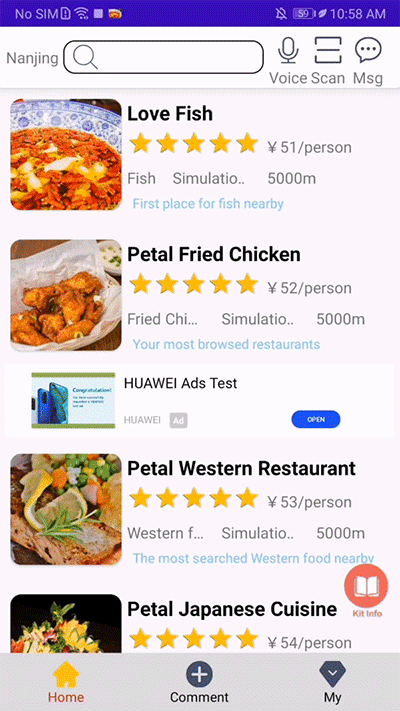

- Location Kit helps you obtain the user's location to calculate the distance between the restaurant and the user, and then generates the food delivery route.

  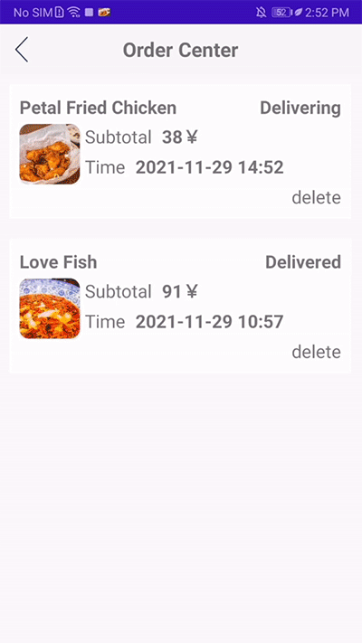

- ML Kit provides functions such as text translation, bank card recognition, and voice search.

  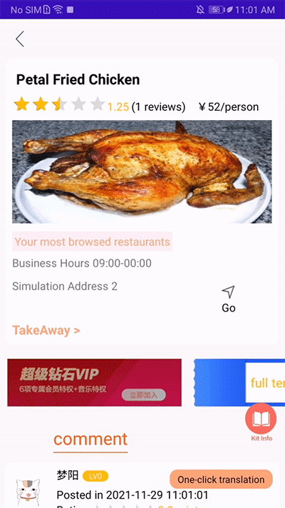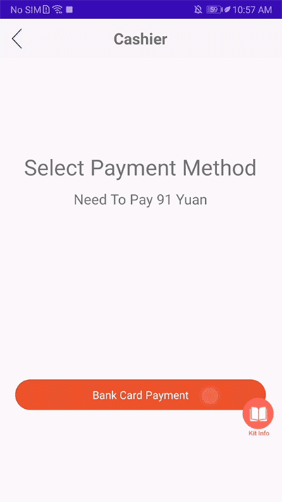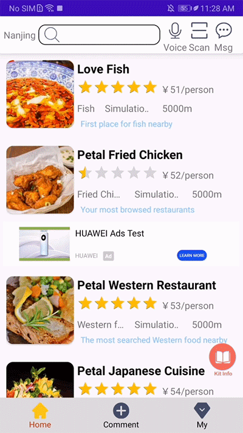

- Panorama Kit allows users to access a 360-degree indoor view of a restaurant.

  

- Video Kit supports playback for the restaurant's introduction video. Users can play or pause the video, and drag the progress bar as they need.

  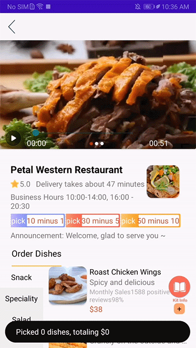

- Image Kit offers the image editing capability so that users are able to edit pictures and post them with their comments.

  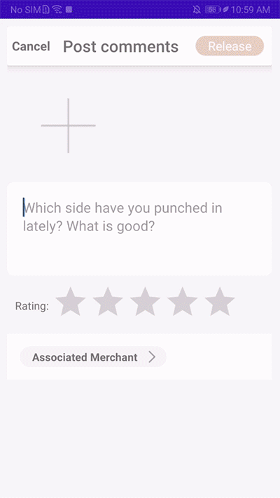

- Site Kit helps users quickly enter their address details.

- Safety Detect protects users' phones by analyzing their security status to safeguard transaction security.

  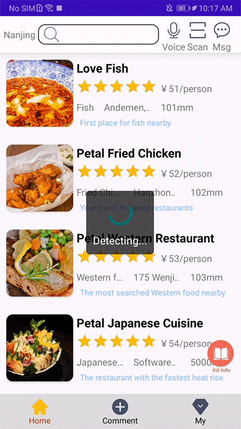

- FIDO enables users to make payments via facial or fingerprint recognition, streamlining the transaction process while ensuring security.

  

- Scan Kit allows users to scan the QR code to quickly find the restaurant and collect coupons.

  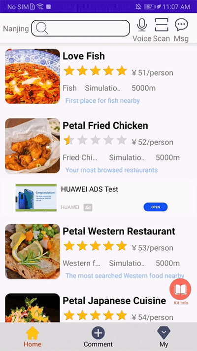

  You can scan the QR codes below to test the functions of Scan Kit:

  QR code for a restaurant

    

  QR code for coupons

  

- You can import membership cards you've obtained to HUAWEI Wallet, for convenient card/coupon management.

  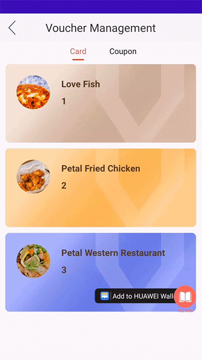

- Analytics Kit collects and reports data on the number of store visit times, visit duration, and dish purchases, helping merchants optimize operations strategies.

## Precautions

The HMS Core lifestyle demo app showcases common food delivery app functions. Some of the demo's content is for reference only, and you may need to customize them yourself.

- Stores in the app are virtual and are not real stores.
- The takeout order function is for simulation purposes only, and you will not incur any fees or order deliveries.
- Coupons in the app that are added to HUAWEI Wallet are for reference only and cannot be exchanged for real discounts.
- The app uses HUAWEI ID to demonstrate the account sign-in function. The profile picture and name of a HUAWEI ID are displayed in the app.
- All ads in the app are test ads.

## Technical Support

You can visit the [Reddit community](https://www.reddit.com/r/HuaweiDevelopers/) to obtain the latest information about HMS Core and communicate with other developers.

If you have any questions about the sample code, try the following:
- Visit [Stack Overflow](https://stackoverflow.com/questions/tagged/huawei-mobile-services?tab=Votes), submit your questions, and tag them with `huawei-mobile-services`. Huawei experts will answer your questions.
- Visit the HMS Core section in the [HUAWEI Developer Forum](https://forums.developer.huawei.com/forumPortal/en/home?fid=0101187876626530001&ha_source=hms7) and communicate with other developers.

If you encounter any issues when using the sample code, submit your [issues](https://github.com/HMS-Core/hms-lifestyle-demo/issues) or submit a [pull request](https://github.com/HMS-Core/hms-lifestyle-demo/pulls).

## License
The HMS Core Lifecycle Demo is licensed under [Apache License 2.0](https://github.com/HMS-Core/hms-life-demo/blob/main/LICENSE).
