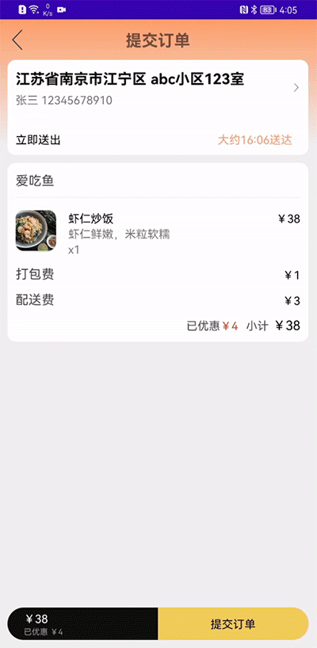

# HMS Core 便捷生活垂域Demo App

中文 | [English](README.md)| [Demo简介](#demo简介) | [Demo 下载](#demo下载) | [基本功能](#基本功能) | [运行步骤](#运行步骤) | [Kit使用描述](#kit使用描述) | [技术支持](#技术支持)

## Demo简介

HMS Core为便捷生活类应用提供了基础能力及创新解决方案，帮助开发者提升应用体验，加速购买转化，增强用户粘性，实现可持续业务增长。

HMS Core便捷生活垂域Demo App演示了外卖浏览，外卖点单，外卖配送，卡券领取，配送地址编辑等外卖App中常见的功能。此Demo将帮助开发者了解如何在便捷生活类应用中集成HMS Core的各项能力，以及这些能力的具体使用场景，如定位服务，地图服务，帐号服务等。

## Demo下载

选择对应的区域，使用浏览器扫描对应的二维码，便可以下载Demo应用。

<table><tr>
<td>

<p>中国</p>
</td>
<td>

<p>亚非拉</p>
</td>
<td>

<p>欧洲</p>
</td>
<td>

<p>俄罗斯</p>
</td>
</tr></table>

## 基本功能

HMS Core便捷生活垂域Demo App涵盖了目前外卖类应用中常用的功能，具体功能如下：

- 全景/视频展示餐厅
- 文字/语音搜索餐厅
- 发表视频/图片评价
- 会员卡/优惠券管理
- 扫码获取优惠券/店铺信息
- 人脸/指纹/银行卡支付
- 消息推送
- 外卖路径规划
- 线下门店导航
- 地址管理
- 订单管理
- 一键翻译
- 广告投放
- 一键登录登出
- 版本更新提示

## 运行步骤

**环境要求**

- Android Studio: 4.2
- Android SDK: 26
- Gradle: 6.3

**本地运行**

1. 克隆代码仓:

   ```
    git clone https://gitee.com/hms-core/hms-lifestyle-demo.git
   ```

您也可以下载包含该项目的Zip包。

1. 将您的jks文件和agconnect-services.json文件拷贝到app目录。关于jks和agconnect-services.json的生成可以参考：[配置AppGallery Connect](https://developer.huawei.com/consumer/cn/doc/development/HMSCore-Guides/config-agc-0000001050196065?ha_source=hms7)

2. 在app/build.gradle文件中更新您的jks文件信息及Application ID。

3. 在命令行中编译应用程序：

   ```
    cd hms-lifestyle-demo
    gradle clean
    gradle build
   ```

## Kit使用描述

- Account Kit帮助用户直接使用华为帐号一键登录，并在后续的App使用过程中用到该帐号。

  

- 当刚打开App时，会调用Ads Kit并展示开屏广告ok；在浏览餐厅列表时，信息流中会展示原生广告。

  

- 当用户提交订单时，Push Kit会推送订单状态消息。

  

- Location Kit获取用户所在位置，用于计算餐厅距离，生成送餐路径。

  

- ML Kit提供文本翻译、银行卡识别、语音搜索等功能。

  

- 用户在查看商家时，全景服务提供店铺全景视图。

  

- Video Kit提供店铺介绍视频播放的能力，包括播放、暂停、拖动等播放控制功能。

  

- 用户发布评论时，Image Kit提供图片编辑能力。

  

- Site Kit可以协助用户快速填入地址信息。

- Safety Detect可以进行手机安全情况分析，保证交易安全。

  

- FIDO服务可以帮助用户进行刷脸和指纹支付，交易方便安全。

  

- 通过Scan Kit扫描二维码快速找到餐厅和获取优惠券。

  

您可以使用下方的二维码，测试相关功能：

餐厅二维码

  

优惠券二维码


- 将获取到的会员卡导入华为钱包，方便用户管理卡券，使用更便捷。

  

- Analytics Kit可以获取统计上报用户店铺访问次数、时长、菜品选购数据，为商家店铺优化提供数据。

## 注意事项

HMS Core便携生活垂域Demo App是外卖类应用的模拟演示。因此店铺是虚拟的，店铺数量是有限的，部分功能是仅供模拟参考。

- App中的店铺为虚拟店铺，现实中不存在。
- 外卖下单的功能为虚拟购买，不会进行实际扣费，不会产生真实配送。
- App中店铺的卡券会添加至华为钱包，仅供模拟，现实中不能使用。
- App中登录的帐户为手机中的华为帐号。App将获取帐号中的头像及帐号名用于App中的展示。
- App中的广告为测试广告。

## 技术支持

如果您想更多的了解HMS Core，欢迎您来到[HMS Core on Reddit](https://www.reddit.com/r/HuaweiDevelopers/) 获取最新的HMS Core的信息，并且和更多的开发者一起进行交流。

如果对使用该样例项目仍然存在疑问，欢迎通过以下渠道告诉我们：
- 建议在[Stack Overflow](https://stackoverflow.com/questions/tagged/huawei-mobile-services?tab=Votes) 中反映开发编程中的问题。请给您的问题打上 `huawei-mobile-services`的标签。
- 建议在[华为开发者论坛](https://developer.huawei.com/consumer/cn/forum/block/hms-core?ha_source=hms7) HMS Core板块中反馈其他问题，或者搜索相关建议和意见。

如果您在样例工程中发现Bug，欢迎您在 [issue](https://gitee.com/hms-core/hms-lifestyle-demo/issues) 中反馈给我们。同时欢迎您直接提交进行修改[Pull Request](https://gitee.com/hms-core/hms-lifestyle-demo/pulls) 。

## Licensing and Terms
HMS Core便携生活垂域Demo使用 [Apache 2.0 license](https://gitee.com/hms-core/hms-life-demo/raw/main/LICENSE).